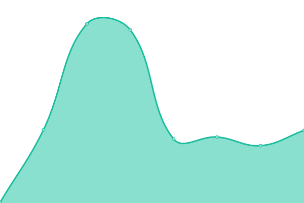
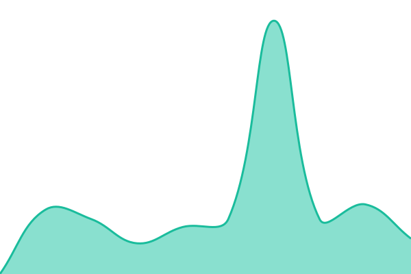

# [📈 Live Status](https://s0m1in.github.io/Monitor-website-uptime): <!--live status--> **🟧 Partial outage**

This repository contains the open-source uptime monitor and status page for [sam](https://boredom.gotdns.com/), powered by [Upptime](https://github.com/upptime/upptime).

With [Upptime](https://upptime.js.org), you can get your own unlimited and free uptime monitor and status page, powered entirely by a GitHub repository. We use [Issues](https://github.com/s0m1in/Monitor-website-uptime/issues) as incident reports, [Actions](https://github.com/s0m1in/Monitor-website-uptime/actions) as uptime monitors, and [Pages](https://s0m1in.github.io/Monitor-website-uptime) for the status page.

<!--start: status pages-->
<!-- This summary is generated by Upptime (https://github.com/upptime/upptime) -->
<!-- Do not edit this manually, your changes will be overwritten -->
<!-- prettier-ignore -->
| URL | Status | History | Response Time | Uptime |
| --- | ------ | ------- | ------------- | ------ |
|  [win](https://boredom.win) | 🟩 Up | [win.yml](https://github.com/s0m1in/Monitor-website-uptime/commits/HEAD/history/win.yml) | 

 1059ms
     
 | 

<a href="https://s0m1in.github.io/Monitor-website-uptime/history/win">100.00%</a>
    

|  [h5](https://oneh5.xiao-xiao-sp.com) | 🟥 Down | [h5.yml](https://github.com/s0m1in/Monitor-website-uptime/commits/HEAD/history/h5.yml) | 

 0ms
     
 | 

<a href="https://s0m1in.github.io/Monitor-website-uptime/history/h5">0.00%</a>
    

|  [xiao-sp](https://xiao-sp.com) | 🟥 Down | [xiao-sp.yml](https://github.com/s0m1in/Monitor-website-uptime/commits/HEAD/history/xiao-sp.yml) | 

 0ms
     
 | 

<a href="https://s0m1in.github.io/Monitor-website-uptime/history/xiao-sp">0.00%</a>
    

|  [a](https://a.unreliable.cc.cd) | 🟥 Down | [a.yml](https://github.com/s0m1in/Monitor-website-uptime/commits/HEAD/history/a.yml) | 

 1028ms
     
 | 

<a href="https://s0m1in.github.io/Monitor-website-uptime/history/a">98.22%</a>
    

|  [b](https://b.unreliable.cc.cd) | 🟥 Down | [b.yml](https://github.com/s0m1in/Monitor-website-uptime/commits/HEAD/history/b.yml) | 

 743ms
     
 | 

<a href="https://s0m1in.github.io/Monitor-website-uptime/history/b">98.22%</a>
    

|  [admin](https://hh.mininglink.cc) | 🟥 Down | [admin.yml](https://github.com/s0m1in/Monitor-website-uptime/commits/HEAD/history/admin.yml) | 

 19547ms
     
 | 

<a href="https://s0m1in.github.io/Monitor-website-uptime/history/admin">0.00%</a>
    

<!--end: status pages-->

[**Visit our status website →**](https://s0m1in.github.io/Monitor-website-uptime)

## 📄 License

- Powered by: [Upptime](https://github.com/upptime/upptime)
- Code: [MIT](./LICENSE) © [sam](https://boredom.gotdns.com/)
- Data in the `./history` directory: [Open Database License](https://opendatacommons.org/licenses/odbl/1-0/)
